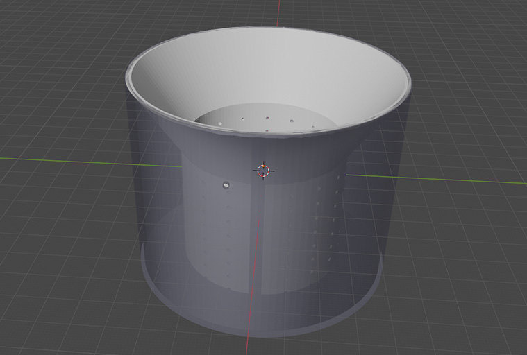
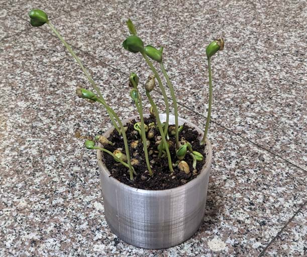

# 不用浇水的花盆！

事情是这样的，我前几周玩了霍格华兹的传承，在游戏里把植物种到花盆里以后，就会自动有魔法水壶跑出来给它浇水。

于是我就想，在现实里给花盆浇水也很麻烦，是不是我也可以发明1个自动浇水的装置？

但是做机械装置很麻烦，所以这件事就拖了很久。

然后有1天，我突然想到可以来模拟地下水！这样1来，不需要机械，只要利用土壤的毛细作用，就可以实现让花盆自己抽水了！

## 模型

这个模型的结构是这样的，它分为2层: 

- 内层<small>(白色部分)</small>是放植物和土的地方。

- 外层<small>(蓝色部分)</small>是放水的地方。

- 内层和外层之间通过很小的孔洞和外层相连，水容易通过孔洞，土壤则较难通过。

这样1来，土壤就可以自己通过毛细作用把水抽到高处，我就不用每天浇水啦！

## 使用方法

把仓库里的`模型.blend`下载回去，然后3D打印出来。

打印好模型之后，把土倒进去，慢慢加水到2/3处，就可以放种子啦！

## 实验效果

实验条件: 

- 植物: 黄豆

- 温度: (20±4)°C

- 时间: 种了1周

- 土: 史丹利家庭园艺营养土

看起来长得不错！

## 注意

1. 不要使用易降解的材料的打印，1般买打印机送的那个PLA是不行的，它会水解。

2. 尽量使用正常速度打印，过高的打印速度可能会使外壁出现小缝，然后漏水。

3. 如果你的植物太大了，可以直接把模型等比例放大，但是要记得把模型里的孔洞的尺寸再缩小回来。

4. 如果你已经有花盆了，也可以把模型的外层删掉，只打印内层，然后粘到你的花盆里。

## 结束

就这样，我要去当生物学家了，大家88！
